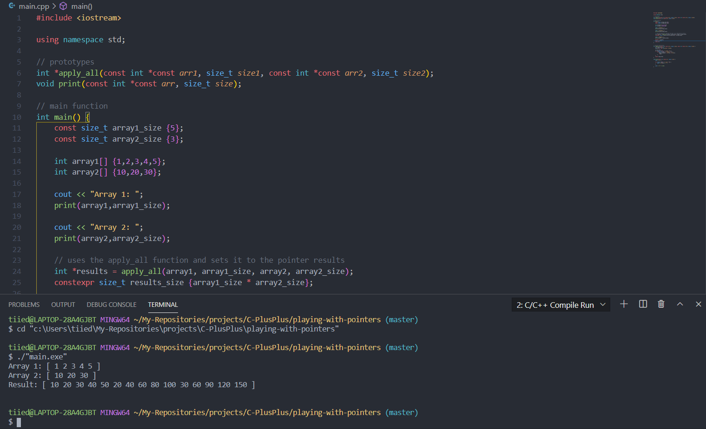

  

# Playing with Pointers
...

### Requirements for VS Code
* C/C++
* C/C++ Compile Run
* mingw

### Instructions
Write a C++ function named apply_all that expects two arrays of integers and their sizes and
dynamically allocates a new array of integers whose size is the product of the 2 array sizes
  
The function should loop through the second array and multiplies each element across each element of array 1 and store the
product in the newly created array.
  
The function should return a pointer to the newly allocated array.
  
You can also write a print function that expects a pointer to an array of integers and its size and display the
elements in the array.